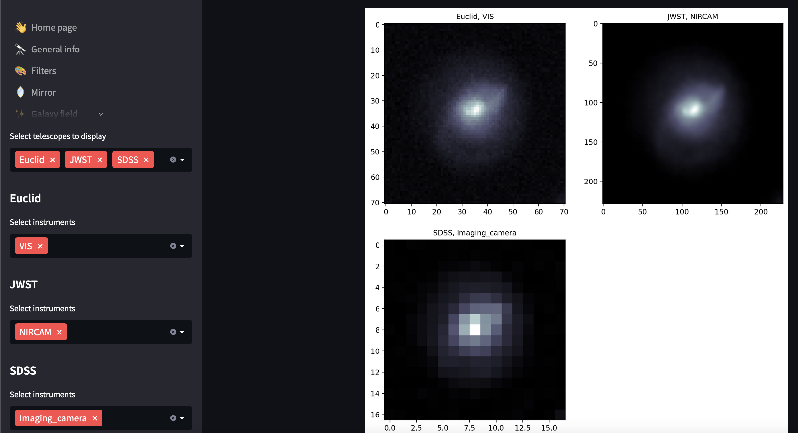
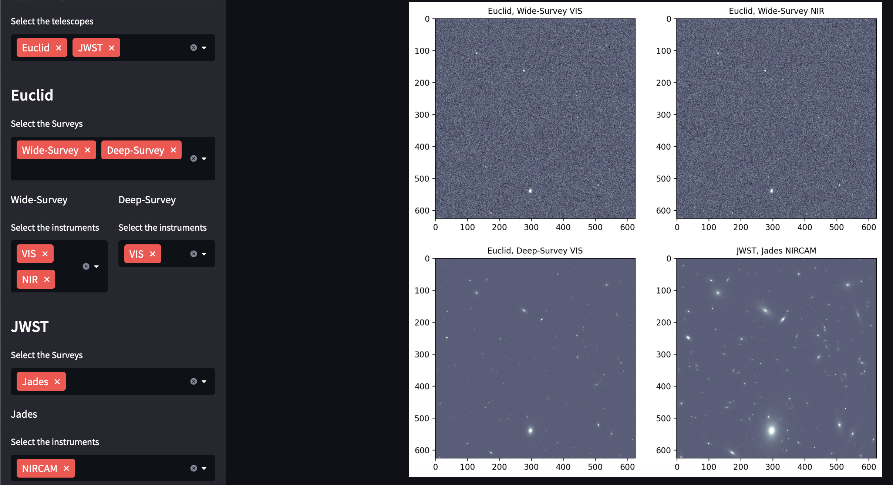

# Welcome to SurViZ, a platform to compare qualitatively various astrophysical missions! 

The platform is hosted with streamlit, and you can visit it here: [https://github.com/Hbretonniere/SurViZ](https://github.com/Hbretonniere/SurViZ)

The project is under construction, feel free to make comments, remarks, or help us adding new missions or features! 

For now, you can use SuViZ for 6 tasks, each one available by clicking in the top left buttons of the main page:

- General infos about the missions (need to be more complete...)
- Explore the filters of the telescopes and instruments
- See the primary mirror size and corresponding field of view
- Compare the depth and PSF on a common simulated galaxy fields
- See the resolution and image quality on a TNG galaxy
- Visualise the area and localization of the various surveys.

  

## To do:
- add a readme or ipynb on how the fields and galaxy are simulated (and verify it's ok...)
- Add LSST galaxy field (need to find sigma noise)
- add SDSS footprint and verify the info (SDSS-I or more ?)
- Try to use cartopy to be able to zoom in surveys
- add precisions on how surveys and galaxies are simulated (which band, which zp when the survey is not uniform etc...)
- Verify Jades zp
- add more surveys...